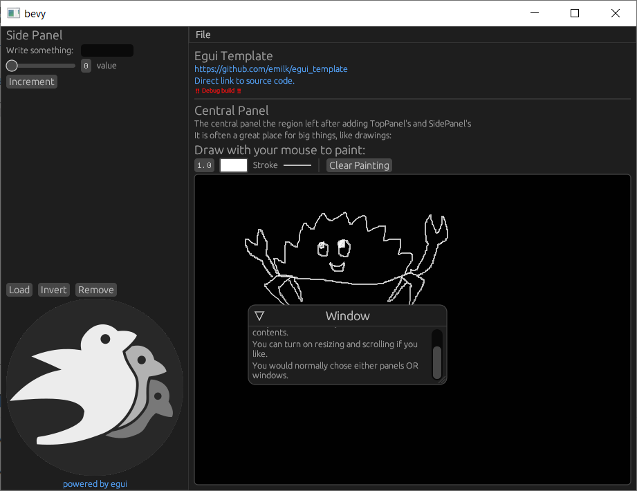

# `bevy_egui`

[](https://crates.io/crates/bevy_egui)
[](https://docs.rs/bevy_egui)
[](https://github.com/bevyengine/bevy/blob/master/LICENSE)
[](https://crates.io/crates/bevy_egui)
[](https://github.com/mvlabat/bevy_egui/actions)

This crate provides a [Egui](https://github.com/emilk/egui) integration for the [Bevy](https://github.com/bevyengine/bevy) game engine.

**Trying out:**

An example WASM project is live at [mvlabat.github.io/bevy_egui_web_showcase](https://mvlabat.github.io/bevy_egui_web_showcase/index.html) [[source](https://github.com/mvlabat/bevy_egui_web_showcase)].

**Features:**
- Desktop and web ([bevy_webgl2](https://github.com/mrk-its/bevy_webgl2)) platforms support
- Clipboard (web support is limited to the same window, see [rust-windowing/winit#1829](https://github.com/rust-windowing/winit/issues/1829))
- Opening URLs
- Multiple windows support (see [./examples/two_windows.rs](./examples/two_windows.rs))

`bevy_egui` can be compiled with using only `bevy` and `egui` as dependencies: `manage_clipboard` and `open_url` features,
that require additional crates, can be disabled.



## Usage

Here's a minimal usage example:
```toml
# Cargo.toml
[dependencies]
bevy = "0.5"
bevy_egui = "0.7"
```

```rust
use bevy::prelude::*;
use bevy_egui::{egui, EguiContext, EguiPlugin};

fn main() {
    App::build()
        .add_plugins(DefaultPlugins)
        .add_plugin(EguiPlugin)
        .add_system(ui_example.system())
        .run();
}

// Note the usage of `ResMut`. Even though `ctx` method doesn't require
// mutability, accessing the context from different threads will result
// into panic if you don't enable `egui/multi_threaded` feature.
fn ui_example(egui_context: ResMut<EguiContext>) {
    egui::Window::new("Hello").show(egui_context.ctx(), |ui| {
        ui.label("world");
    });
}
```

For a more advanced example, see [examples/ui.rs](examples/ui.rs).

```bash
cargo run --example ui
```

## See also

- [`jakobhellermann/bevy-inspector-egui`](https://github.com/jakobhellermann/bevy-inspector-egui)
- [`mvlabat/bevy_megaui`](https://github.com/mvlabat/bevy_megaui)

## Bevy support table

|bevy|bevy_egui|
|---|---|
|0.5|0.4-0.6|
|0.4|0.1-0.3|
